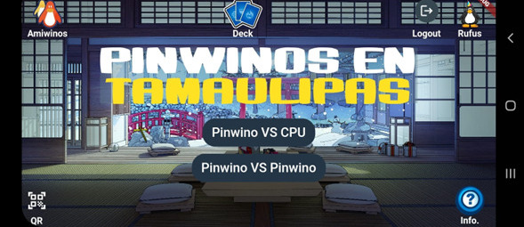
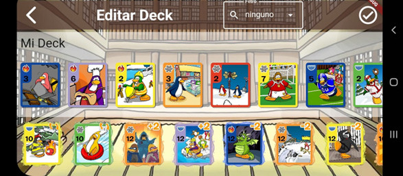
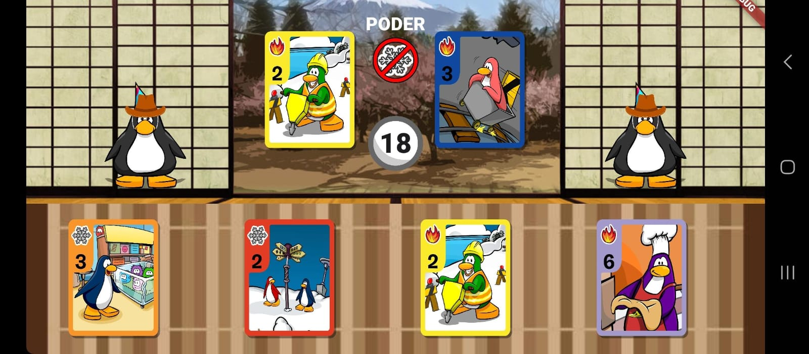

# Proyecto Final
- El proyecto es una reimaginacion del juego de Cardjitzu con ciertos añadidos:
- Personalizacion del mazo con el que se va a jugar
- Lista de amigos
- Modo de Batalla Off Line contra una inteligencia artifical diseñada
para el combate propio del juego
- Modo de Batalla On Line de dos jugadores

## Tecnologias
- Uso de Cupertino para diseño de las interfaces
- BLoC para gestion de eventos y estados
- Cuenta con autenticacion de usuarios con Firebase Authentication
- Uso de Firestore Database tanto en BLoC como UI para gestion de datos
- Se utiliza el escaner QR con la camara del celular para agregar cartas a un jugador

## Lo que costo mas trabajo
Sin dudas, uno de los principales retos del programa fue el manejo
de tantos estados y eventos, que si bien no fue dificil, si complejo
y tardado.
Además, el entendimiento del Widget StreamBuilder fue algo
tardado de lograr pero sencillo una vez realizada la primera
implementación.

## Lo que se aprendio
- Mejora del entendimiento general de Firestore Database
- Uso de StreamBuilder
- Uso de varios BLoCs a la vez y unos dentro de otros

## Screenshots

